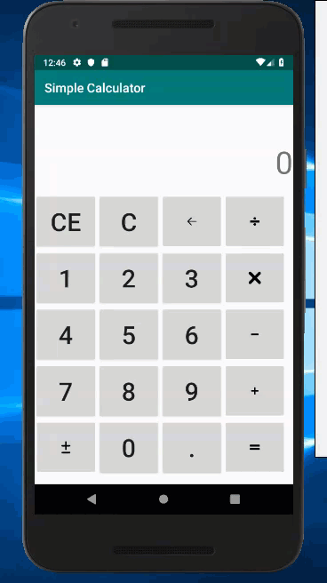

# Android-SimpleCalculator
A simple calculator that calculates addition, subtraction, mulitiplication and division

## Learning Outcome
- Familiarized with Android Studio IDE
- Android Studio development layout
  - Buttons/ImageButtons
  - TextView
  - Plain Text
  - Relative layout and Linear layout
- View OnClick Events
  - View Objects
- Java arithmetic operations and data types
  - `BigDecimal`
  - `double`
  - `String`
  - `enum`
- `DecimalFormat`
- Java `String` manipulation
  - `String.substring()`
  - `String.length()`
  - `String.charAt()`
  - `String.valueOf()`

## Project Showcase
<table>
  <tr>
    <td>Supports a mix of operations</td>
    <td>Change operator in the middle of an operation</td>
  </tr>
  <tr>
    <td></td>
    <td></td>
  </tr>
  <tr>
    <td>Backspace to delete a digit</td>
    <td>Clear all operations</td>
  </tr>
  <tr>
    <td></td>
    <td></td>
  </tr>
  <tr>
    <td>Clear most recent entry</td>
    <td>Change of sign</td>
  </tr>
  <tr>
    <td></td>
    <td></td>
  </tr>
</table>

## Future Development
- Allows maximum input of 16 digits, and adjust size as digits grow large to fit the screen
- Make the calculator layout more aesthetically pleasing

